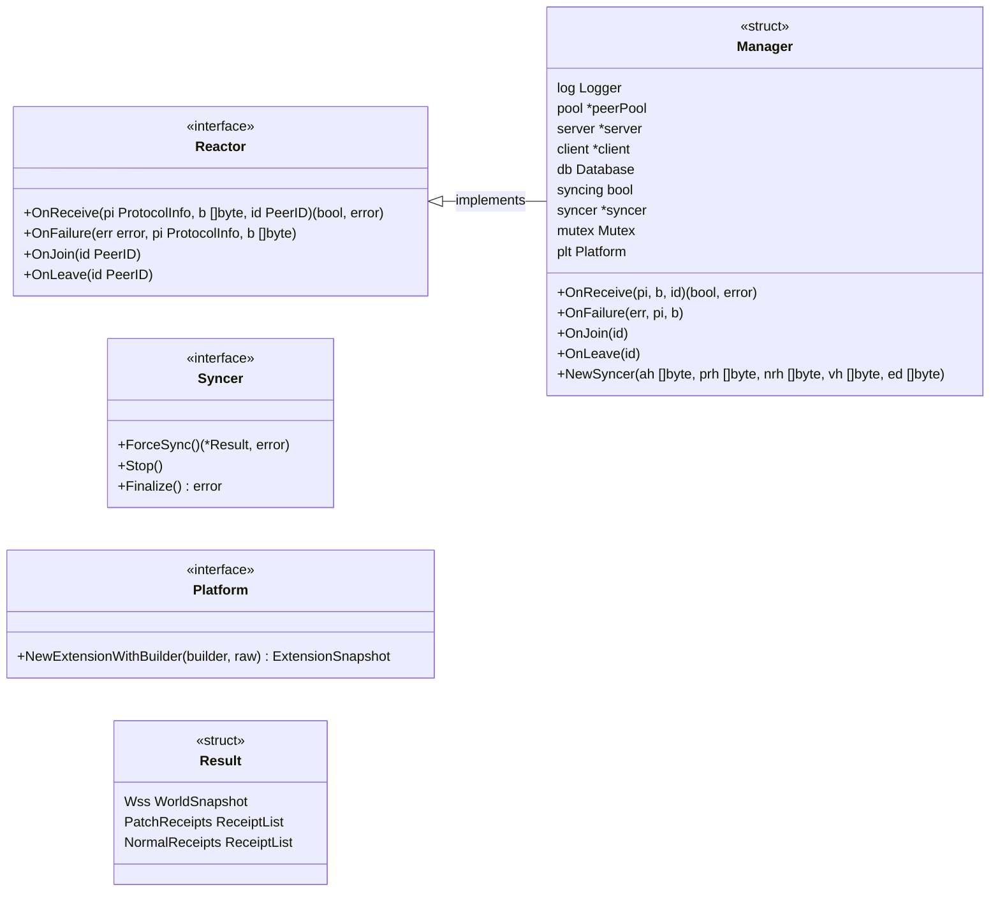
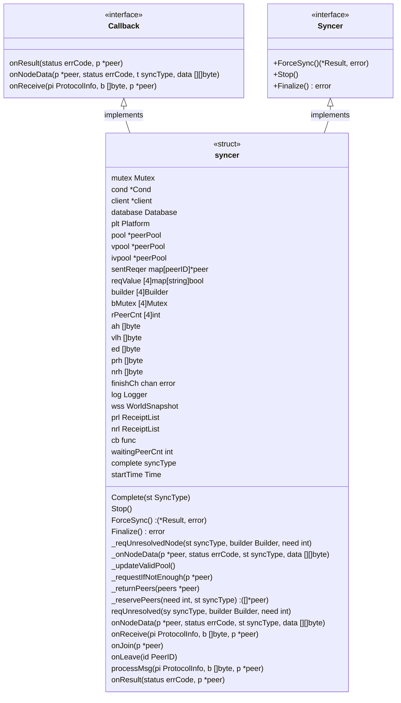
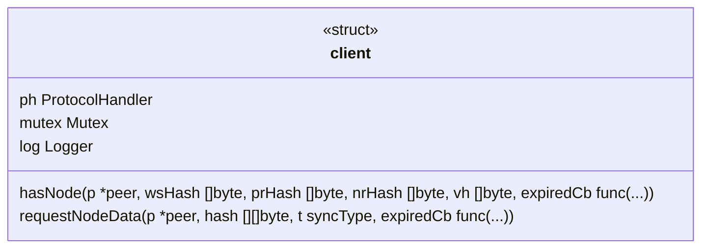
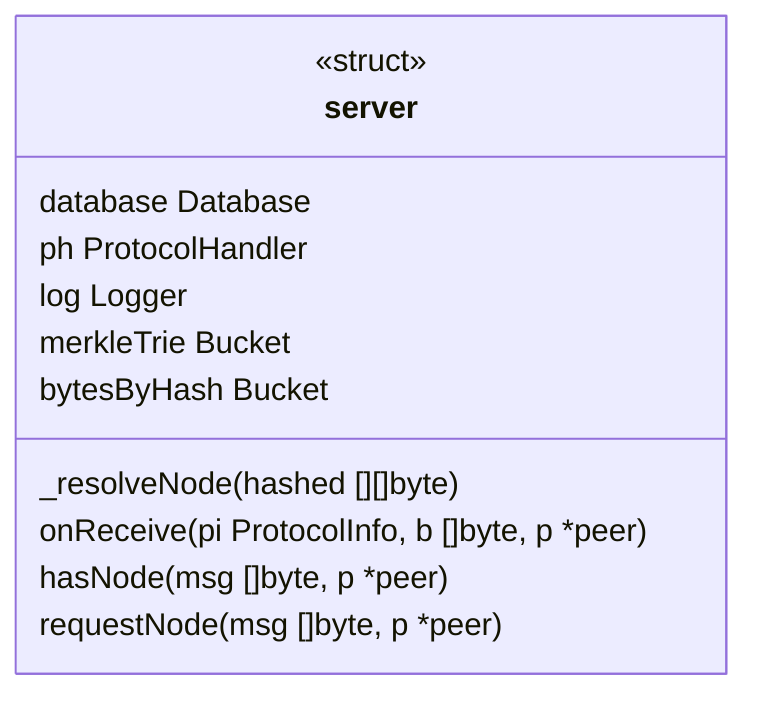
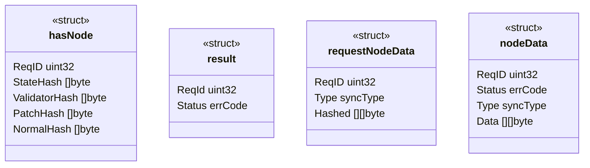
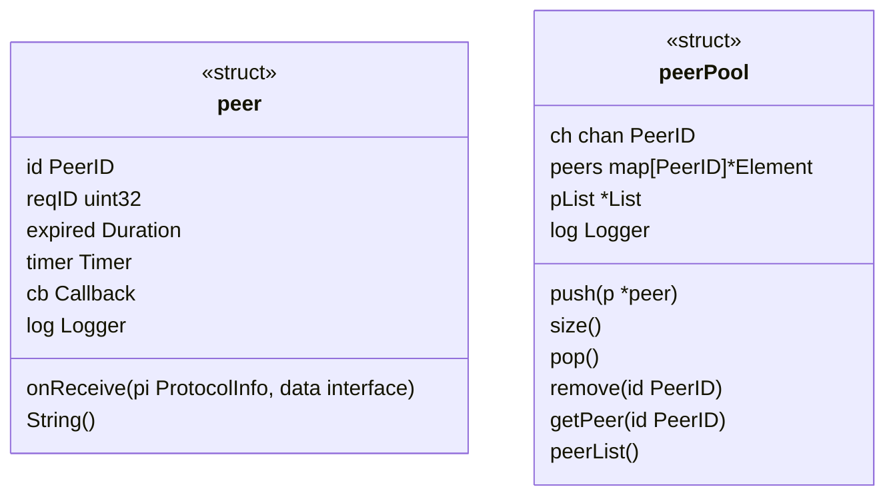
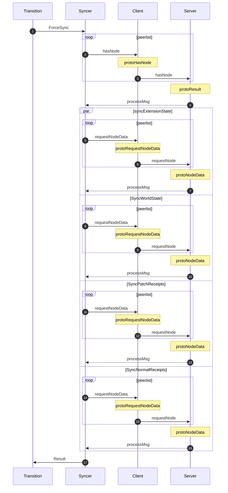

# State Sync

## Manager

Manager implements Reactor of Network module

## Syncer

syncer implements Syncer of Manager interface and Callback interface

## client

## server

## protocol

 4 protocols defined
  - protoHasNode
  - protoResult
  - protoRequestNodeData
  - protoNodeData

## peer

## Sequence diagram

### Force State Sync

